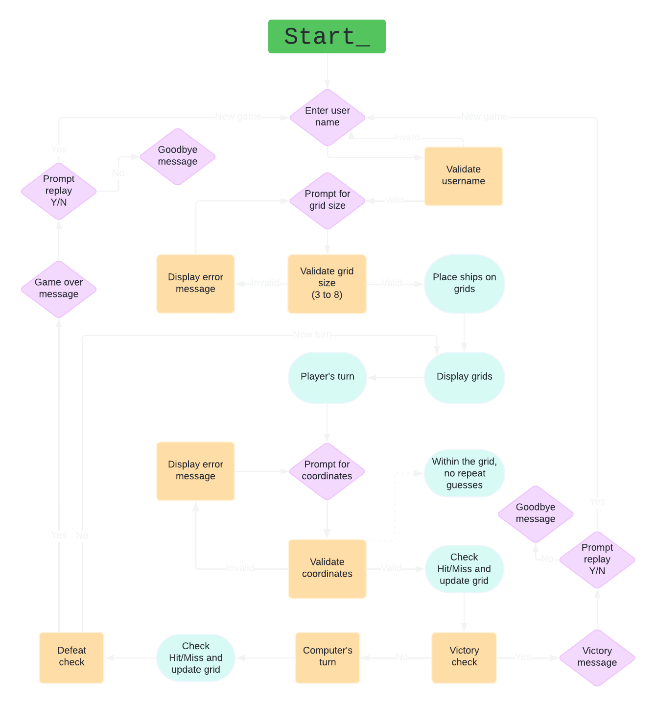

# Battlefield

The Battleship game is a classic two-player strategy game where the objective is to sink all of the opponent's ships. In this Python implementation, the player competes against the computer.

## [Live Website](https://pp3-battlefield-b25fdc0835a9.herokuapp.com/)

## [Repository](https://github.com/arthur-vilela/PP3-battlefield)


## Table of contents

1. <a href="#flowchart">Flowchart</a>
2. <a href="#game-flow">Game Flow</a>
3. <a href="#technologies-used">Technologies used</a>
4. <a href="#testing">Testing</a>
5. <a href="#bugs">Bugs</a>
6. <a href="#validator-testing">Validator testing</a>
7. <a href="#deployment">Deployment</a>
8. <a href="#credits">Credits</a>
9. <a href="#acknowledgements">Acknowledgements</a>

## Flowchart



## Game Flow

Game Flow
The Battleship game is a classic two-player strategy game where the objective is to sink all of the opponent's ships. In this Python implementation, the player competes against the computer. The game proceeds through the following steps:

> ### 1. Introduction and Setup

- The game begins with a welcome screen displaying the title of the game.

- The player is prompted to enter their name, which will be used throughout the game.

- The player is then asked to choose the size of the grid on which the game will be played. The grid size can range from 3x3 to 8x8.

- Based on the selected grid size, a certain number of ships are placed randomly on both the player’s and the computer’s grids.

  

> ### 2. Displaying the Grids

- The player's grid is displayed, revealing the locations of their ships (S).

- The computer's grid is also displayed, but with the ships hidden, represented by ~ (water).

  

>### 3. Gameplay Loop

- The game enters a loop where the player and the computer take turns to attack each other’s grid by selecting coordinates.

  #### 3.1 Player's Turn

  - The player is prompted to enter the row and column numbers for their attack.
    

  - If the selected coordinate has already been chosen, the player is informed and asked to choose a different coordinate.

  - The game checks whether the player's attack hits a ship on the computer's grid:


    - Hit: The grid is updated to mark the hit with an X, and an explosion animation is displayed.
      

    - Miss: The grid is updated to mark the miss with an O, and a miss animation is displayed.
      

  - The updated computer grid is then displayed with hidden ships.
    

  #### 3.2 Victory Check

- After the player's turn, the game checks if all of the computer's ships have been sunk.

- If all ships are hit, the player wins, and the game congratulates the player before ending the loop.
  

  #### 3.3 Computer's Turn

- The computer randomly selects a coordinate on the player's grid to attack.

- The game checks whether the computer's attack hits a ship on the player's grid:

  - Hit: The grid is updated to mark the hit with an X, and a message is displayed informing the player of the hit.

  - Miss: The grid is updated to mark the miss with an O, and a message is displayed informing the player of the miss.

- The updated player's grid is then displayed with the locations of ships revealed.

  #### 3.3 Defeat Check

  - After the computer's turn, the game checks if all of the player's ships have been sunk.
  
  - If all ships are hit, the computer wins, and the game displays a game-over message before ending the loop.

    

>### 4. Game Over and Replay

- Once the game loop ends (either due to a player win or loss), the player is asked if they want to play again.

- If the player chooses to play again (Y), the game restarts from the beginning with a new grid setup.

- If the player chooses not to play again (N), the game displays a farewell message and exits.
  

>### 5. Exiting the Game
Upon exiting, the game displays a message thanking the player for playing.

## Technologies Used

## Testing


| User story / Feature | Test Method | Expected Outcome | Outcome | Pass/Fail |
|--|--|--|--|--|
| **I want to know when my inputs are accepted** | Enter an invalid grid size (e.g., 2 or 9) | The game should display an error message prompting for a valid grid size between 3 and 8. |  | Pass |
| **I want to know what data to enter and when a wrong value is entered** | Enter a non-integer value when prompted for grid size (e.g., "abc") | The game should display an error message prompting for a valid integer. |  | Pass |
| **I want to place ships on the grid** | Start the game and observe the player's grid after ships are placed | Ships ('S') should be randomly placed on the grid based on grid size. |  | Pass |
| **I want to avoid entering a coordinate already used** | Enter a coordinate that has already been shot at | The game should display a message indicating that the coordinate has already been chosen, and prompt the player to select a new one. |  | Pass |
| **I want to see if I hit or miss the opponent's ship** | Take a shot at a coordinate on the computer's grid | The game should display "Hit!" or "Miss!" depending on whether a ship was hit. |   | Pass |
| **I want to see the grid updated after each turn** | After each shot, observe the computer's grid display | The grid should update with 'X' for hits and 'O' for misses. |  | Pass |
| **I want the computer to take its turn after mine** | Observe the game after the player takes a turn | The computer should randomly select a coordinate on the player's grid and update it with 'X' or 'O'. |  | Pass |
| **I want to know when I've won the game** | Sink all of the computer's ships | The game should display a congratulatory message indicating the player has won. |  | Pass |
| **I want to know when I've lost the game** | Let the computer sink all of the player's ships | The game should display a message indicating that the player has lost. |  | Pass |
| **I want to play the game again after finishing** | After winning or losing, choose to play again by entering 'Y' | The terminal should be cleared. The game should restart with a new grid and ship placements. |  | Pass |
| **I want the game to exit when I choose not to play again** | After winning or losing, choose not to play again by entering any value other than "Y" or "y" | The game should display a goodbye message and exit. |  | Pass |


## Bugs

### The size input was being received as a string, instead of integer.
  ```
  File "/workspace/PP3-battlefield/run.py", line 4, in __init__
      self.grid = [['-' for _ in range(size)] for _ in range(size)]
                                                      ^^^^^^^^^^^
  TypeError: 'str' object cannot be interpreted as an integer
  ```

  - Fixed by adding `int()` to the function

### TypeError due to positional arguments mismatch

  ```
  $ python3 run.py
  Please enter your name: 
  Art
  Hi Art, enter grid size (e.g., 5 for a 5x5 grid): 
  3
  Traceback (most recent call last):
    File "/workspace/PP3-battlefield/run.py", line 54, in <module>
      main()
    File "/workspace/PP3-battlefield/run.py", line 43, in main
      player_grid.place_ships()
  TypeError: Grid.place_ships() takes 0 positional arguments but 1 was given
  ```

  - Fixed by adding `self` as a parameter in `place_ships()` function. This parameter is necessary for it to access the Grid instance and check if the cell is empty in `self[row][col]`

  ### TypeError: 'Grid' object is not subscriptable

  ```
  Traceback (most recent call last):
    File "/workspace/PP3-battlefield/run.py", line 54, in <module>
      main()
    File "/workspace/PP3-battlefield/run.py", line 43, in main
      player_grid.place_ships()
    File "/workspace/PP3-battlefield/run.py", line 28, in place_ships
      if self[row][col] == "-": # Checks if hte cell is empty ("-")
        ~~~~^^^^^
  TypeError: 'Grid' object is not subscriptable
  ```

  >  "This error occurs because of a mistake in how you're trying to access the grid within the place_ships method. 
Specifically, the line if self[row][col] == "-" is trying to use the Grid object itself as if it were a list, but self refers to the entire Grid object, not just the grid attribute inside it." - [**Fernando Vilela**](https://github.com/vmafer)

  ### SyntaxError: 'break' outside loop
  ```
  gitpod /workspace/PP3-battlefield (main) $ python3 run.py
    File "/workspace/PP3-battlefield/run.py", line 148
      break
      ^^^^^
  SyntaxError: 'break' outside loop
  ```
  Solved indentation issue by moving the if statement into the while loop

  ```
  # Check for victory condition (all ships hit)
      if all(cell != 'S' for row in computer_grid.grid for cell in row):
          print(f"\nCongratulations {user_name}, you've sunk all the computer's ships!")
          break
  ```
## Validator testing

The code in `run.py` was run in [Code Institute's Python Linter](https://pep8ci.herokuapp.com/#) showing no errors found.


## Credits

- Solution for the positional argument bug was found in [this answer](https://stackoverflow.com/questions/43839536/typeerror-generatecode-takes-0-positional-arguments-but-1-was-given) on StackOverflow

- Solution for the `TypeError: 'Grid' object is not subscriptable` bug was given by developer [Fernando Vilela](https://github.com/vmafer)

- Explanation and examples for enumerate function used on the grid was taken from this [GeeksforGeeks](https://www.geeksforgeeks.org/enumerate-in-python/) tutorial.

- Line of code used to clear the terminal after every round and when game is restarted was taken from this [StackOverflow answer](https://stackoverflow.com/a/36941376/26410724). The idea for it was given by my mentor [Alan Bushell](https://github.com/Alan-Bushell).
  ```
  import os
  os.system('cls||clear')
  ```

- The function `time.sleep()` was found and explained in this [Code Institute](https://codeinstitute.net/global/blog/how-to-wait-in-python/) post

## Deployment

When you create the app, you will need to add two buildpacks from the _Settings_ tab. The ordering is as follows:

1. `heroku/python`
2. `heroku/nodejs`

You must then create a _Config Var_ called `PORT`. Set this to `8000`

Connect your GitHub repository and deploy as normal.

## Constraints

The deployment terminal is set to 80 columns by 24 rows. That means that each line of text needs to be 80 characters or less otherwise it will be wrapped onto a second line.

---

## Acknowledgements

